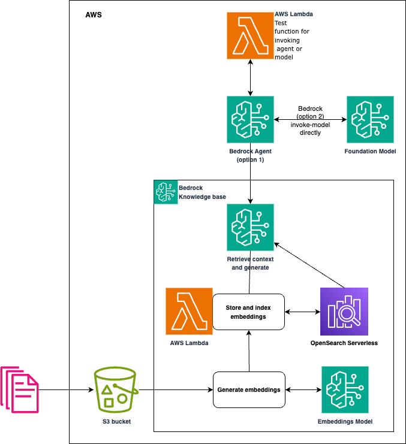

# aws-tools/Bedrock/cdk/agent-aoss

This folder includes application code and IaC (infrastructure-as-code) to build and deploy a generative AI (Gen AI) service, which is implemented with [Amazon Bedrock](https://aws.amazon.com/bedrock/).

Jump to:
- [Architecture Overview](#architecture-overview)
- [Built with](#built-with)
- [Quick Start](#quick-start)
- [Code Structure](#code-structure)
- [Local Development](#local-development)
- [References](#references)

## Architecture Overview

The application has two main components:
- The Gen AI component is implemented with [Amazon Bedrock Agent](https://aws.amazon.com/bedrock/agents/), [Amazon Bedrock Knowledge Base](https://aws.amazon.com/bedrock/knowledge-bases/), [Amazon OpenSearch Serverless (AOSS)](https://aws.amazon.com/opensearch-service/features/serverless/), and [Amazon S3](https://aws.amazon.com/s3/).
  1. Use a Bedrock agent and knowledge base with the [supported foundation models (FMs)](https://docs.aws.amazon.com/bedrock/latest/userguide/models-supported.html) for text/chat based messages. Default models: Anthropic Claude 3 Sonnet (for text/chat) and Cohere Embed English v3 (for embeddings).
  2. Use Bedrock runtime to invoke a model directly (without using Bedrock Agent) for prompt-based image generation. Default model: Titan Image Generator v2
- Data source connectors
  - Knowledge Base includes a S3 buckets for uploading static documents.

The diagram below describes the current architecture of the application.

## Built with

- AWS Gen AI services (see [Architecture Overview](#architecture-overview)).
- [Python 3.12](https://www.python.org/) for code.
- [AWS CDK](https://docs.aws.amazon.com/cdk/v2/guide/getting_started.html) (Python) for IaC (infrastructure-as-code)
- [Docker](https://www.docker.com/) for containerisation of Lambda function code.
- [GitHub Actions workflows](https://docs.github.com/en/actions/using-workflows) for CICD.

## Quick Start

### Step 1: Review and update app settings

1. Update settings in [dev.yml](environment/dev.yml), and create one for dev/prd when needed.
2. Update runner in GitHub Actions workflow [bedrock-build.yml](.github/workflows/bedrock-build.yml)

### Step 4: Deploy the Slack App

You can deploy the Slack App with the GitHub Actions workflow [assistant-deploy](.github/workflows/bedrock-build.yml).

** Make sure the stack will be deployed in an AWS region where Amazon Bedrock with the [supported foundation models (FMs)](https://docs.aws.amazon.com/bedrock/latest/userguide/models-supported.html) are available.

## Code structure

The code in this project is organised as follows:

- [`app/lambda`](app/lambda): Lambda code. All lambdas are implemented in python with container runtimes. (TODO not all but will be)
  - [`collections`](app/lambda/collections): Lambda code implementing the [`CfnCustomResource`](https://docs.aws.amazon.com/cdk/api/v2/docs/aws-cdk-lib.CfnCustomResource.html) that creates the index in the OpenSearch Serverless Collection.
  - [`kb_sync`](app/lambda/kb_sync): Lambda code that will trigger a Knowledge Base sync every time that a file is added/removed from the S3 bucket created during deployment.
- [`cdk/`](cdk): CDK python code for deploying the infrastructure.
  - [`bedrock_agent_stack.py`](cdk/backend/bedrock_agent_stack.py): Main CDK Stack code
  - [`bedrock_aoss.py`](cdk/backend/bedrock_aoss.py): An opinionated, easy-to-use, CDK construct that creates the OpenSearch Serverless Collection, Bedrock Agent and Bedrock knowledge base, all using native CDK L1 constructs. The OpenSearch Serverless Collection Index is, however, created as a Custom resource in this stack with the code in the [`collections`](app/lambda/collections) lambda, since it cannot be created with CDK today.
  - [`app.py`](cdk/app.py): Main entrypoint for the code. Won't typically be executed directly but with `cdk` as described in the Setup section.
- [`environment`](environment/): Custom application configs and deployment settings.
- [`resources`](resources): Folder with Agent definition resources. It contains a text document with the base agent prompt.

## Local Development

- You can use [Makefile](Makefile) locally. For the sequence of call, see the GitHub Actions workflow [bedrock-build.yml](.github/workflows/bedrock-build.yml).

## References

Bedrock
1. [aws-samples/genai-messaging-hotel-assistant](https://github.com/aws-samples/genai-messaging-hotel-assistant) - This project provides thorough IaC foundation.
1. [build-on-aws/building-gen-ai-whatsapp-assistant-with-amazon-bedrock-and-python](https://github.com/build-on-aws/building-gen-ai-whatsapp-assistant-with-amazon-bedrock-and-python) - This project exposes LangChain agents using WhatsApp. It provides more chat-related functionality.

For Slack App, see
1. [kyhau/slack-chat-app-cdk](https://github.com/kyhau/slack-chat-app-cdk).
