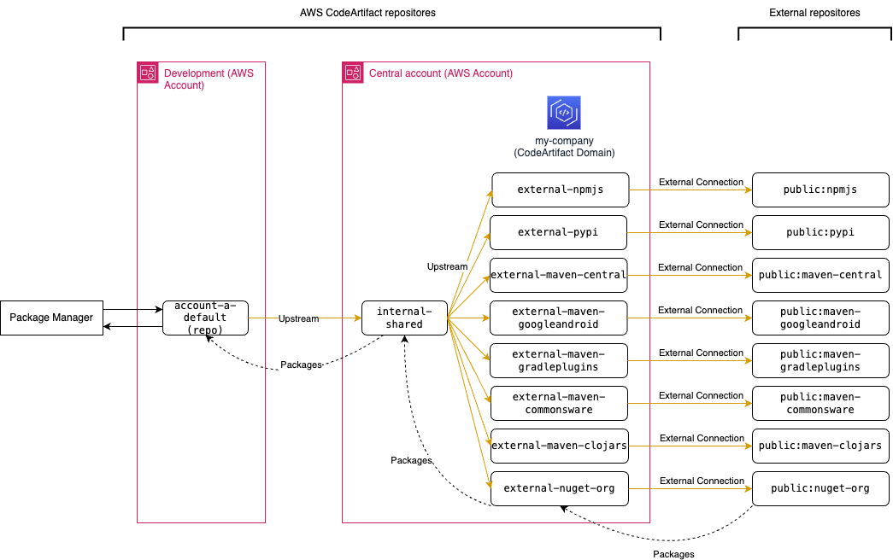

# CodeArtifact

[](https://github.com/kyhau/aws-tools/actions/workflows/codeartifact-build.yml)

This folder includes infrastructure-as-code (IaC) of
1. [central_resources](./central_resources/) 0 the central AWS CodeArtifact repositories in the domain owner account, consists of:
    - the single CodeArtifact domain `my-company` that contains all published artifacts,
    - shared CodeArtifact repositories for connecting to external repositories (see `EXTERNAL_CONNECTIONS` in environment/dev.yml), and
    - a shared CodeArtifact repository `internal-shared` for sharing with all accounts.
2. [account_resources](./account_resources/) account-specific CodeArtifact repositories (e.g. account-a-default) under the same domain owner with `internal-shared` as its upstream repo; see [account_resources/environment/dev.yml](./account_resources/environment/dev.yml).



## Built with

- CDK, Python, AWS CodeArtifact
- [black](https://github.com/psf/black) is used for Python formatting.
- [cdk-validator-cfnguard](https://github.com/cdklabs/cdk-validator-cfnguard) is used to locally validate CDK app using AWS Control Tower proactive controls or AWS CloudFormation Guard rules before deploying the AWS infrastructure.
- [cdk-nag](https://github.com/cdklabs/cdk-nag) is used for security/compliance checks on the CDK app.
- [cfn-lint](https://github.com/aws-cloudformation/cfn-lint) is used for Python formatting.
- [flake8](https://github.com/PyCQA/flake8) is used for Python linting.
- [yamllint](https://github.com/adrienverge/yamllint) is used for GitHub Actions workflow linting.
- [Dependabot version updates](https://docs.github.com/en/code-security/dependabot/dependabot-version-updates) is [enabled](.github/dependabot.yml) in this repository.

## Deployment

Modify the GitHub Actions workflow for deployment
- [.github/workflows/codeartifact-build.yml](.github/workflows/codeartifact-build.yml)

## Local Development

[Makefile](./Makefile) is used for both GitHub Actions workflows and local development.

### Run CDK tests locally
```
cd central_resources/

# Create and activate virtual env if needed
make install
ENV=dev make synth
make test
make pre-commit
```

### Run cross account uploading/downloading tests
```
cd tests/

# Create and activate virtual env if needed
make install
export ENV=dev

make pre-commit

# OR run individiual tests
make test-repo-exist
make test-generic
make test-nuget
make test-python
```

### Pre-commit
```
cd central_resources/
ENV=dev make synth
make test
make pre-commit

cd ../tests
ENV=dev make pre-commit
```

## Usage Examples

The following examples have been implemented:
- NuGet
    - [Method 1](./central_resources/tests/nuget/test_nuget_method_1.sh): Configure with the CodeArtifact NuGet Credential Provider
    - [Method 2](./central_resources/tests/nuget/test_nuget_method_2.sh): Configure nuget or dotnet with the `codeartifact login` command
    - [Method 3](./central_resources/tests/nuget/test_nuget_method_3.sh): Configure nuget or dotnet without the login command
- Python
    - [`twine` and `pip`](./central_resources/tests/python/test_twine_publish_pip_download.sh)

## Tests

Each pull request build will create a new set of resources with postfix `-branchname`, and run the following tests as part of the build. These resources will be deleted at the end of the workflow run.

To run the test scripts:
```
make test-repo-exist
make test-python
make test-nuget
```
