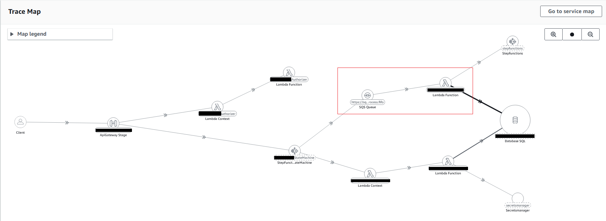

# Some X-Ray notes

- [Segment and subsegment in Lambda](#segment-and-subsegment-in-lambda)
- [SQS to Lambda](#sqs-to-lambda)

| AWS X-Ray Daemon | [aws/aws-xray-daemon](https://github.com/aws/aws-xray-daemon) |
| AWS X-Ray SDK (Python) | [aws/aws-xray-sdk-python](https://github.com/aws/aws-xray-sdk-python) |

---
## Segment and subsegment in Lambda

- Summary of facade segment and new segment/subsegments in Lambda.
    - https://github.com/aws/aws-xray-sdk-node/issues/148
    - https://github.com/aws/aws-xray-sdk-node/issues/160

- `AWSXray.getSegment()` returns the root segment from the previous invocation.
    - https://theburningmonk.com/2017/06/aws-x-ray-and-lambda-the-good-the-bad-and-the-ugly/

- The `in_progress` subsegment is discarded in favor of the completed subsegment.
    - i.e. (in_progress === undefined)
    - Ref: https://docs.aws.amazon.com/xray-sdk-for-nodejs/latest/reference/

- By default, the X-Ray SDK records the first request each second, and five percent of any additional requests.

- Sampling rules
  https://docs.aws.amazon.com/xray/latest/devguide/xray-console-sampling.html#xray-console-sampling-options

- Segment doc max 64 kb
  https://docs.aws.amazon.com/xray/latest/devguide/xray-api-segmentdocuments.html

- Dynamically adjusting X-Ray sampling rules
  https://aws.amazon.com/blogs/mt/dynamically-adjusting-x-ray-sampling-rules/

---
## SQS to Lambda

Update:
> AWS X-Ray adds trace linking for event-driven applications built on Amazon SQS and AWS Lambda (https://aws.amazon.com/about-aws/whats-new/2022/11/aws-x-ray-trace-linking-event-driven-applications-amazon-sqs-lambda/)

Previous approach:

(Outdated): SQS supports X-Ray tracing but it does not propagate the trace to a Lambda function. Lambda always starts a new trace.-

See:
- aws-xray-sdk-node: https://github.com/aws/aws-xray-sdk-node/issues/208.
    - Possible workaround: Create a new segment for the lambda to link to the parent (sqs)
- aws-xray-sdk-dotnet: https://github.com/aws/aws-xray-sdk-dotnet/issues/110

Workaround:
- Create a new segment to replace the facade segment created by Lambda, and retrieve the trace ID and parent ID from the trace header (from the SQS segment).
- Example: [xray-sqs-to-lambda/handler.ts](xray-sqs-to-lambda/handler.ts)

